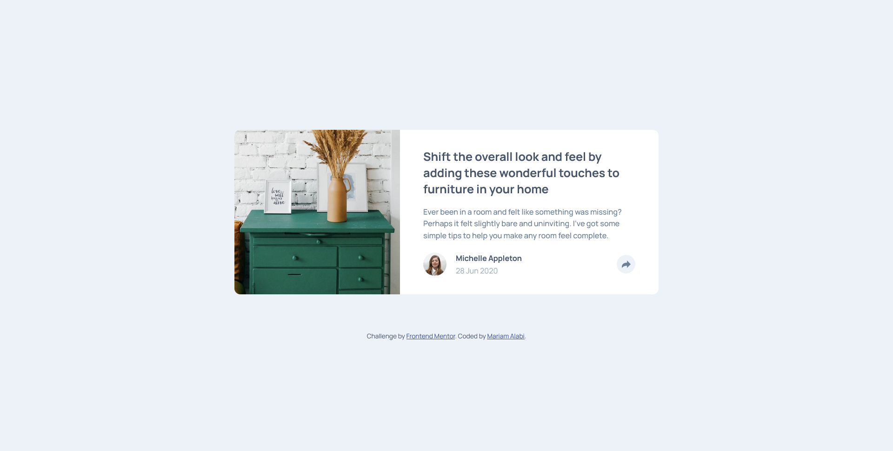
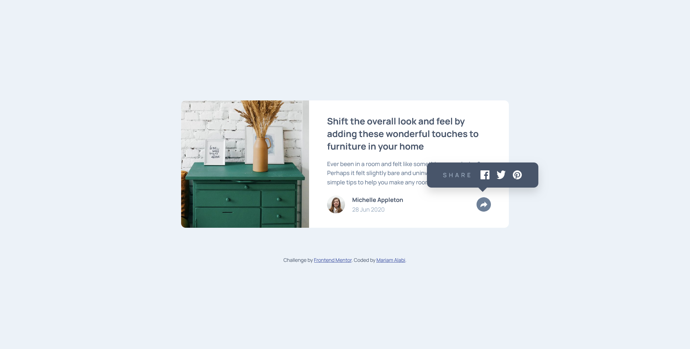
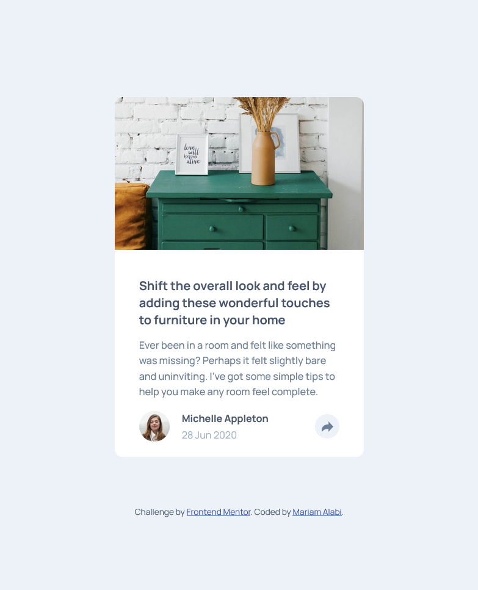
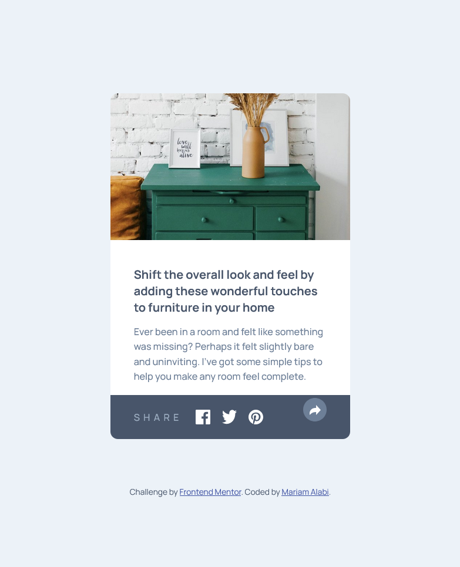

# Frontend Mentor - Article preview component solution

This is a solution to the [Article preview component challenge on Frontend Mentor](https://www.frontendmentor.io/challenges/article-preview-component-dYBN_pYFT). Frontend Mentor challenges help you improve your coding skills by building realistic projects.

## Table of contents

- [Overview](#overview)
  - [The challenge](#the-challenge)
  - [Screenshot](#screenshot)
  - [Links](#links)
- [My process](#my-process)
  - [Built with](#built-with)
  - [What I learned](#what-i-learned)
  - [Continued development](#continued-development)
- [Author](#author)

## Overview

### The challenge

Users should be able to:

- View the optimal layout for the component depending on their device's screen size
- See the social media share links when they click the share icon
- Experience different share panel behaviors on mobile (overlay) vs desktop (tooltip)

### Screenshot

#### Desktop views




#### Mobile views




### Links

- Solution URL: [Add solution URL here]()
- Live Site URL: (https://mar-alabi.github.io/article-preview-component/)

## My process

### Built with

- Semantic HTML5 markup
- CSS custom properties (CSS variables)
- Flexbox for layout
- CSS positioning (absolute/relative)
- Mobile-first workflow
- Vanilla JavaScript for interactivity

### What I learned

This project significantly improved my understanding of CSS positioning, particularly working with absolute positioning for tooltips and overlays. I learned how to:

1. **Create responsive tooltips** - Building a tooltip that appears above the share button on desktop using absolute positioning:

```css
.share-panel {
  display: none;
  position: absolute;
  bottom: 90px;
  right: -65px;
  left: auto;
  width: 248px;
  background-color: var(--darkgrayishblue);
  padding: 1.125rem 2.25rem;
  border-radius: 10px;
  box-shadow: 0 10px 20px rgba(0, 0, 0, 0.15);
}
```

2. **Handle different UI patterns per breakpoint** - The share panel behaves differently on mobile (full-width overlay) versus desktop (tooltip), which required careful planning of the CSS architecture.

3. **Manage z-index layering** - Ensuring the share button stays on top of the overlay while maintaining proper stacking context:

```css
.user-profile.active .share-btn {
  background-color: var(--desaturated-dark-blue);
  position: relative;
  z-index: 10;
}
```

4. **Work with CSS pseudo-elements** - Creating the tooltip arrow using `::after` pseudo-element:

```css
.share-panel::after {
  content: "";
  position: absolute;
  bottom: -10px;
  left: 50%;
  transform: translateX(-50%);
  width: 0;
  height: 0;
  border-left: 10px solid transparent;
  border-right: 10px solid transparent;
  border-top: 10px solid var(--darkgrayishblue);
}
```

### Continued development

While this project helped me understand positioning better, I want to continue improving in these areas:

- **Advanced CSS positioning** - More complex tooltip positioning scenarios and dynamic positioning
- **Accessibility** - Adding keyboard navigation for the share panel and improving screen reader support
- **JavaScript state management** - Implementing more robust state handling for interactive components
- **CSS animations** - Adding smooth transitions when the share panel appears/disappears

## Author

- Frontend Mentor - [@mar-alabi](https://www.frontendmentor.io/profile/mar-alabi)
- GitHub - [@mar-alabi](https://github.com/mar-alabi)
